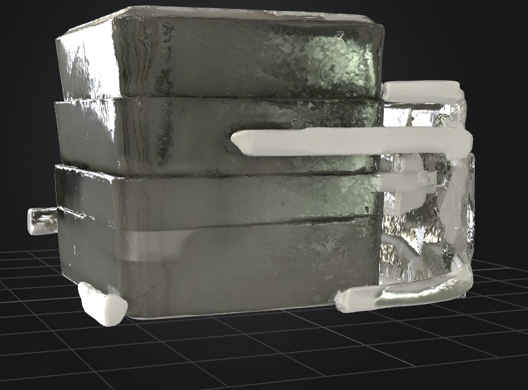
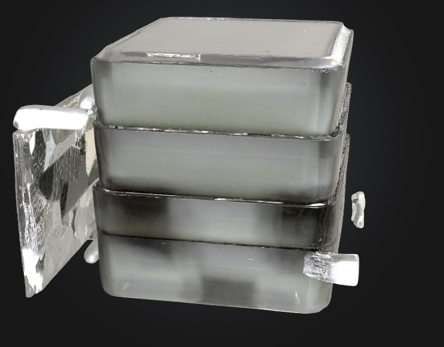
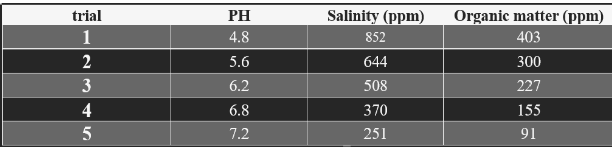
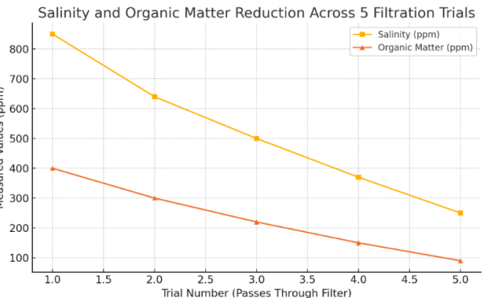
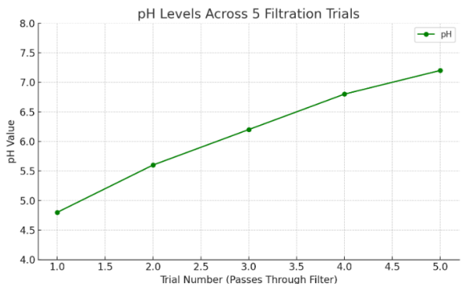
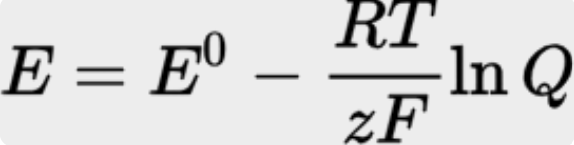
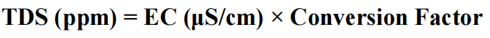
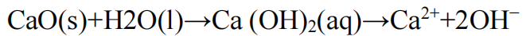

# ⏱ Total Time Spent: 52 hours

---

##  Day 1 – 2/7
**Time Spent:** 3 hours  
**Activities:**
- Initial research on water pollution in Beheira’s rural areas.
- Decided on El-Bostan village as a deployment target.
- Identified major contaminants (heavy metals, pesticides, turbidity).
- Drafted a system overview diagram for the 3d model.

---

##  Day 2 – 3/7
**Time Spent:** 4 hours  
**Activities:**
- Studied biosand filtration layers.
- Chose media: silica sand, zeolite, gravel.
- Reviewed scholarly articles on wood ash & graphene oxide applications.
- Ordered graphene oxide and prepared clean wood ash samples.
- Begin the first steps of the 3d model on the cad model

---

##  Day 3 – 4/7
**Time Spent:** 6 hours  
**Activities:**
- Added modular cartridge-based internal sections.
- Working on the 3d model

---

##  Day 4 – 5/7 
**Time Spent:** 5 hours  
**Activities:**
- Connected TDS, pH sensor, and relay module for pumps on the simulations.
- Programmed feedback loop logic: if pH or TDS out of range → re-treat cycle.
- Working on the 3d model

##  Day 5 – 6/7
**Time Spent:** 5 hours  
**Activities:**
- Tested the servo-controlled flow gates between purification stages.
- Took TDS and pH readings at each stage.
- Working on the 3d model

---

##  Day 6 – 7/7
**Time Spent:** 6 hours  
**Activities:**
- Integrated a water quality display using OLED module.
- Refined Arduino loop for reliability in low-voltage scenarios in the code.
- Working on the 3d model

---

##  Day 7 – 8/7
**Time Spent:** 8 hours  
**Activities:**
- Finalized enclosure, waterproof sealing, and solar-battery interface.
- Working on the 3d model

---

##  Day 8 – 9/7  
**Time Spent:** 7 hours  
**Activities:**
- Created full wiring diagram.
- Compiled BoM with links and prices.
- Working on the 3d model

---

##  Day 9 – 10/7 
**Time Spent:** 8 hours  
**Activities:**
- Wrote final README.md and created GitHub repo.
- Uploaded CAD source files, code, and sensor libraries.
- Finalized the 3d model.
- Final testing and calibration documentation.

---
**Media:**  

expected results:

researched equations used when identifying the dimensions and materials:

