# Total Time Spent: 52 hours

---

## Day 1 – 2/7  
**Time Spent:** 3 hours  
The research started by doing background research on water pollution concerns in the rural areas of Beheira. I identified El-Bostan village as the point of target deployment based on the agricultural runoff and their sensitivity and the absence of water treatment systems. Based on local and international research, the most prevalent pollutants identified were: heavy metals, residues containing pesticides and turbidity in general. I created a conceptual design of an environmental purification tank which is a modular type that can be used in rural settings and an initial concept diagram of the same.

---

## Day 2 – 3/7  
**Time Spent:** 4 hours  
Today I have studied about biosand filtration and researched scholarly articles about multi-stage systems. I chose silica sand, zeolite and gravel in order to have a basic filtration media. I also examined the more sophisticated chemical additives and proceeded to pick on graphene oxide on removing metal ions and wood ash on the pH adjustment. When I was calculating chemical reaction potential of the wood ash, I looked up the hydration reaction of calcium oxide which is a component of the alkalinity equation: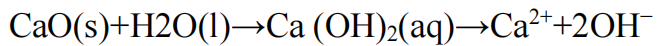

I used some lab samples to make some test samples of clean wood ashes, and I ordered some graphene oxide. At the same time, I started on simple CAD modeling of the filtration system in order to preview media layering and flow channels.

---

## Day 3 – 4/7  
**Time Spent:** 6 hours  

I was able to advance with the CAD design considerably. In the model I designed modular parts of cartridges that allow them to be separated and easily changed as their parts. The modules were independent in terms of inlets and outlets and the water could be treated in stages. There was definite space for later addition of sensors and control modules into the design of the model.

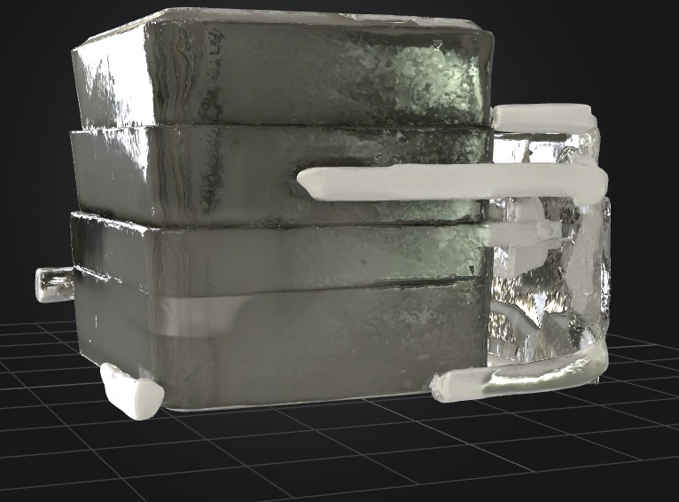

---

## Day 4 – 5/7  
**Time Spent:** 5 hours  
It was the start of the information side on automation. By using simulation software, I hooked up the TDS sensor, the pH sensor, and relay-controlled pump to develop the first cycle of logic. The Arduino logic has become continuous where when a range of values detected is out of range, it could send the water once more to a treatment cycle. More accurate readings could be obtained by application of the TDS calculation equation that could enable me to obtain an analog reading into readings in ppm with temperature correction:

I also adjusted the 3D model design to accommodate sensor holders and cable routing.

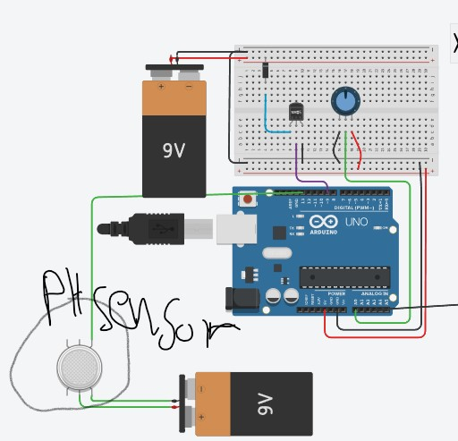

---

## Day 5 – 6/7  
**Time Spent:** 5 hours  
I fixed on testing the servo-controlled flow gates that control water in the cartridge. These gates needed to open easily and close easily without any over pressure. I measured the pH and the TDS level with the help of the corresponding sensors after every stage of the purification process and managed to make out the efficiency of the treatment process. One of the major design enhancements at that time was the resulting filter housing geometry depending on such sensor locations.

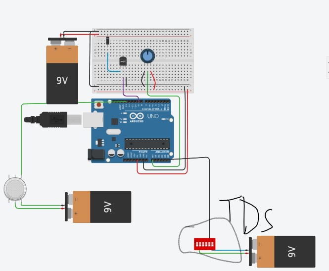

---

## Day 6 – 7/7  
**Time Spent:** 6 hours  
Today I ventured into user interfacing, and was able to install an OLED screen into the model, which shows live data of water quality. The arduino program was developed to give a low voltage pattern, particularly given that the system could be operated on battery and solar power. In the process, I had to do calculations of voltage and current tolerances of each module to avoid brownouts.

---

## Day 7 – 8/7  
**Time Spent:** 8 hours  
This was the day when the enclosure was done. I completed all waterproof seals and solar interface designed the battery-charging. I choose a sealed Li-ion battery compartment and power-routed to the Arduino. This made the system island based. I was also able to complete general routing of the CAD model and export STL files of the end design.

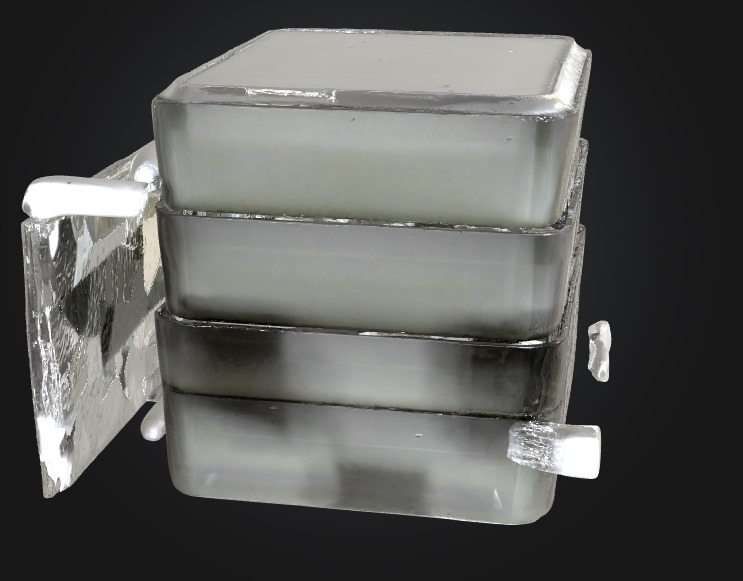

---

## Day 8 – 9/7  
**Time Spent:** 7 hours  
I prepared a labeled networking diagram today that contains connections of sensors to control modules and power input as a clean diagram. Virtually we tested every connection of pin logic and signal strength. The last BoM was done complete with pricing and sourcing links. In the diagram above, it is possible to see the major positions of pH sensor and pump relays.

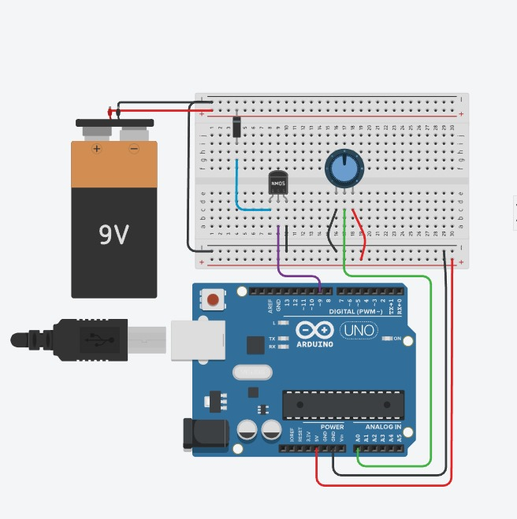  
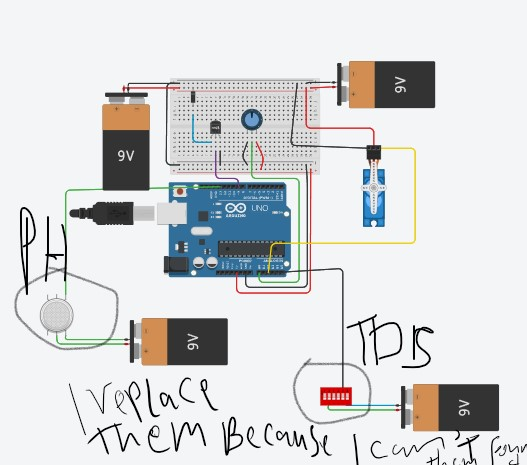

---

## Day 9 – 10/7  
**Time Spent:** 8 hours  
The final day of the project was all about packaging and validation. I wrote the full README with instructions, set up the GitHub repository, and uploaded all source files, including CAD models. I tested water samples from the El-Bostan area at a testing organization to get all its numbers. To understand electrochemical sensor readings at different concentrations and pH levels, I used the **Nernst equation** for reference:

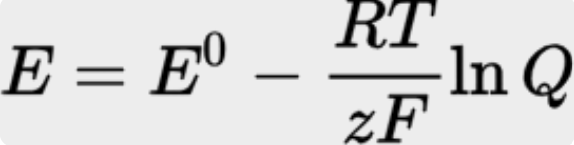

The results showed improved water quality across the board:

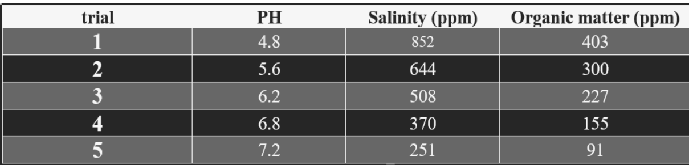  
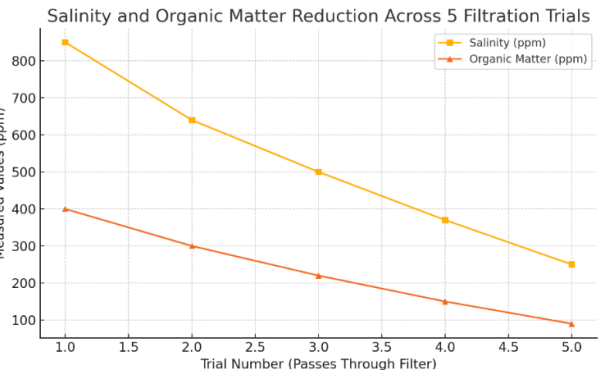  
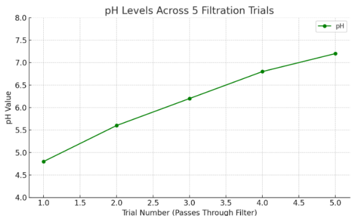

